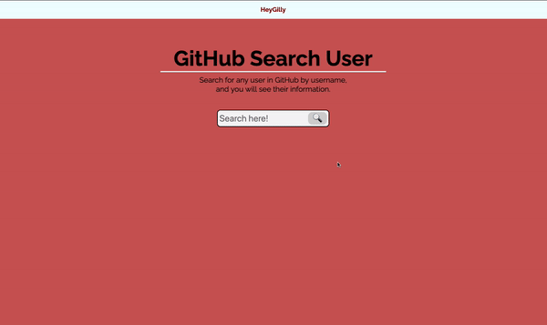

<h1 align="center">
   
  
   
  GitHub User Search
   
</h1>

<h4 align="center">
With this application, we will be using the GitHub API to search for any specific user by username.
With Vanilla Javascript and CSS, you can use the search bar & get the user's image, name, and whether they are hireable.
</h4>

## Live View
- <a href="github-search-username-gilly.netlify.app"> Click Here</a>

## Languages

The languages used to create this application:
- HTML
- CSS
- Vanilla Javascript

## Pathway

* [X] Google Fonts
* [X] Navigation
* [X] Main Header
* [X] Description
* [X] Search Bar
  * [X] Animation
* [X] Add fake user to see how it will look when information is pulled
* [X] Work on Javascript functionality
  * Capture search bar value with the hit of the search button
  * Create an X button that will hide the main section
      

---

> Linkedin [/HeyGilly](https://www.linkedin.com/in/heygilly) &nbsp;&middot;&nbsp;
> GitHub [@HeyGilly](https://github.com/HeyGilly) &nbsp;&middot;&nbsp;